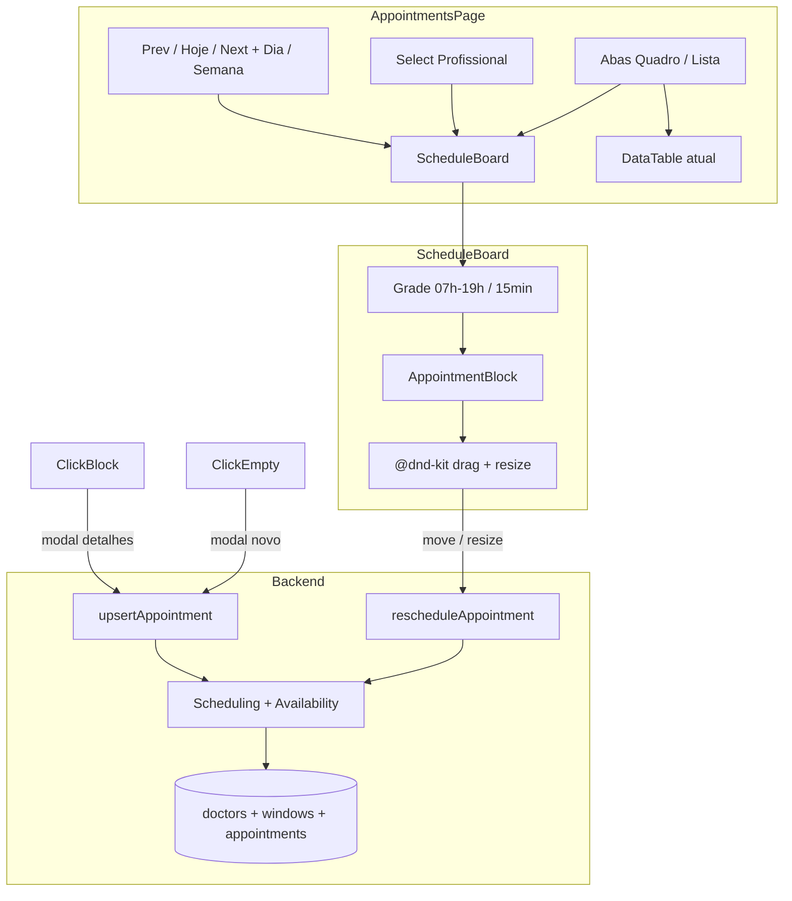

# Quadro de agendamentos (drag-and-drop) — Design

**Data:** 2026-07-20  
**Status:** aprovado

## Objetivo

Substituir a experiência principal de manuseio de agendamentos por um quadro semanal/diário com arrastar-e-soltar e redimensionamento de duração, respeitando a disponibilidade do profissional e o padrão técnico do app (Next.js App Router, Drizzle, next-safe-action, ShadCN, Dayjs).

## Decisões fechadas

| Tema | Decisão |
|------|---------|
| Duração | `durationInMinutes` no agendamento + `defaultAppointmentDurationInMinutes` no profissional |
| Página `/appointments` | Abas **Quadro** (padrão) e **Lista** |
| Escopo do quadro | Um profissional por vez (select acima do quadro) |
| Clique no bloco | Modal de detalhes + ações Editar / Cancelar |
| Clique em célula vazia | Modal de novo agendamento (form existente) |
| Implementação do quadro | CSS Grid custom + `@dnd-kit` |
| Disponibilidade | Por dia da semana, com **múltiplos intervalos** por dia |
| Nomenclatura | UI: “Profissional”; código/banco: manter `doctor*` nesta entrega |
| Slots | Passo de **15 minutos**; grade visual 07:00–19:00 |
| Cancelados / no-show | Não exibir no quadro |

## Fora de escopo

- Renomeação completa `doctor*` → `professional*` no schema/código
- Lista de espera, observações, impressão (controles da imagem de referência que não existem hoje)
- Visão multi-profissional no mesmo quadro

## Arquitetura

## Modelo de dados

### Profissional (`doctors`)

- Adicionar `defaultAppointmentDurationInMinutes` (integer, not null, default 30; múltiplo de 15).
- Remover após migração: `availableFromWeekDay`, `availableToWeekDay`, `availableFromTime`, `availableToTime`.

### Janelas de disponibilidade (`doctor_availability_windows`)

| Coluna | Tipo | Notas |
|--------|------|--------|
| `id` | uuid PK | |
| `doctor_id` | uuid FK → doctors | cascade |
| `week_day` | integer 0–6 | 0 = domingo |
| `start_time` | time | |
| `end_time` | time | `start < end` |
| `created_at` / `updated_at` | timestamp | |

Regras:

- Vários registros por `(doctor_id, week_day)` = múltiplos intervalos (ex.: 08–12 e 14–18).
- Dia sem registros = indisponível.
- Sem overlap entre intervalos do mesmo dia.
- Duração mínima de cada intervalo: 15 minutos.

Migração dos dados atuais: para cada médico, expandir o intervalo contínuo de dias e o par de horários em N linhas (um intervalo por dia no range), depois dropar as quatro colunas antigas.

### Agendamento (`appointments`)

- Adicionar `duration_in_minutes` (integer, not null, default 30).
- Conflito: overlap de intervalos `[date, date + duration)` no mesmo `doctor_id`, excluindo o próprio id e status cancelados.

## Domínio de disponibilidade e slots

Atualizar [`src/core/modules/scheduling/domain/availability.ts`](src/core/modules/scheduling/domain/availability.ts):

- `ProfessionalAvailability` passa a ser lista de janelas `{ weekDay, startTime, endTime }[]`.
- `generateTimeSlots(from, to, stepMinutes = 15)`.
- `computeAvailableSlots` gera slots de 15 min **dentro** das janelas do dia; marca ocupados considerando duração (um agendamento de 45 min bloqueia 08:00, 08:15 e 08:30 como início inválido, ou equivalente por overlap).
- Helpers: `isWithinAvailability(start, duration, windows)`, `intervalsOverlap(a, b)`.

Booking público e `getAvailableTimeSlots` usam o mesmo domínio.

## UI — página de agendamentos

### Abas

- `Quadro` | `Lista` (ShadCN Tabs).
- Quadro como default.

### Toolbar do quadro

- Select **Profissional** (obrigatório; default = primeiro da clínica).
- Navegação: anterior / Hoje / próximo.
- Label do período (ex.: “19/07 a 25/07” ou “Segunda, 20/07”).
- Toggle **Dia | Semana** (desktop).
- Em viewport &lt; 768px (`useIsMobile`): força visão Dia; toggle Semana oculto ou desabilitado.

### Grade

- Colunas: 7 dias (semana) ou 1 dia.
- Linhas: 07:00–19:00, passo 15 min.
- Altura fixa por slot; altura do bloco = `(duration / 15) * slotHeight`.
- Linha sólida nas horas; tracejada nos :15/:30/:45.
- Dia atual destacado; indicador de horário atual quando o período inclui “agora”.
- Slots fora das janelas do profissional: estado **bloqueado** (fundo distinto, sem clique, drop/resize rejeitados).

### AppointmentBlock

- Texto: `HH:mm – HH:mm` + nome do paciente.
- Estilo com token CTA do tema; variação leve por status (`pending` / `confirmed`).
- Drag: move dia + horário com snap de 15 min.
- Resize: handle na borda inferior; duração múltiplo de 15; mín. 15; máx. até fim da grade, fim da janela de disponibilidade ou início do próximo agendamento.
- Clique (sem drag): modal de detalhes.

### Modais

- **Novo:** reutiliza `UpsertAppointmentForm` com profissional/data/hora pré-preenchidos; campo duração (default do profissional).
- **Detalhes:** read-only (paciente, profissional, horário, duração, tipo, status, valor) + Editar + Cancelar.
- **Editar / Cancelar:** fluxos já existentes na lista.

Copy da UI: usar “Profissional”, não “Médico”, nos textos tocados por esta feature (select do quadro, forms de agendamento relacionados, empty states do quadro).

## Actions e persistência

| Action | Uso |
|--------|-----|
| `upsertAppointment` | Criar/editar completo; schema ganha `durationInMinutes` |
| `rescheduleAppointment` | Move/resize no quadro: `id`, `date`, `time`, `durationInMinutes` |
| `cancelAppointment` | Modal de detalhes / lista |
| `getAvailableTimeSlots` | Form + booking; slots 15 min + novas janelas |
| `upsertDoctor` | Persiste janelas + duração padrão |

`rescheduleAppointment` e `upsertAppointment` validam no servidor: disponibilidade, overlap, múltiplo de 15, auth/plano.

UI do quadro: update otimista; em erro (conflito / fora da disponibilidade), toast + rollback.

Cadastro do profissional ([`upsert-doctor-form.tsx`](src/app/(protected)/doctors/_components/upsert-doctor-form.tsx)):

- Substituir range único por lista Dom–Sáb (switch + intervalos add/remove).
- Campo duração padrão da consulta.

## Responsividade

- Desktop: semana por padrão; toggle Dia/Semana.
- Mobile (&lt; md): somente Dia; scroll vertical na grade; toolbar empilhada.
- Lista permanece acessível na aba Lista com o padrão atual de tabela.

## Erros e edge cases

- Drop em slot bloqueado ou ocupado: rejeitar; manter posição anterior.
- Resize que atravessa outro agendamento ou sai da janela: limitar ao máximo válido ou rejeitar no drop.
- Sem profissionais na clínica: empty state pedindo cadastro de profissional.
- Sem janelas cadastradas: quadro todo bloqueado + aviso.
- Agendamentos legados sem duração: migração preenche 30.

## Testes

- Unitários de domínio: slots 15 min, multi-janela, overlap, migração conceitual do modelo antigo, `isWithinAvailability`.
- Use case: `reschedule` com conflito e fora da disponibilidade.
- E2E (se encaixar no harness atual): abrir quadro, navegar dia/semana, abrir modal em célula vazia (smoke).

## Arquivos principais a tocar

- [`src/db/schema.ts`](src/db/schema.ts) + migração Drizzle
- [`src/core/modules/scheduling/domain/availability.ts`](src/core/modules/scheduling/domain/availability.ts)
- Repositórios / use-cases de scheduling e professionals
- [`src/actions/upsert-appointment`](src/actions/upsert-appointment), nova `reschedule-appointment`, `upsert-doctor`, `get-available-time-slots`
- [`src/app/(protected)/appointments/`](src/app/(protected)/appointments/) — abas, board, detalhes
- [`src/app/(protected)/doctors/_components/upsert-doctor-form.tsx`](src/app/(protected)/doctors/_components/upsert-doctor-form.tsx)
- `package.json` — `@dnd-kit/core`, `@dnd-kit/utilities` (e correlatos necessários)

## Critérios de aceite

1. Quadro semanal 7 colunas × slots 15 min (07:00–19:00), com visão Dia e navegação de período.
2. Mobile mostra apenas Dia.
3. Altura do bloco proporcional à duração; resize de 15 em 15.
4. Drag move para horário disponível; persiste no banco.
5. Slots fora da disponibilidade do profissional ficam bloqueados.
6. Cadastro do profissional permite múltiplos intervalos por dia da semana.
7. Clique vazio → novo; clique no bloco → detalhes.
8. Aba Lista preserva a tabela atual.
9. UI usa “Profissional”.
