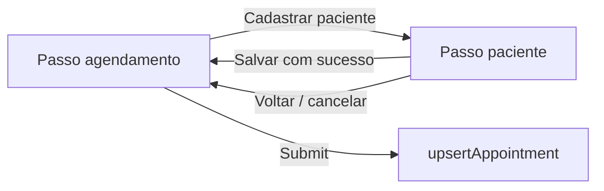

# Busca de paciente no modal de agendamento — Design

**Data:** 2026-07-21  
**Status:** aprovado

## Objetivo

Substituir o `Select` de paciente no modal de novo/editar agendamento por um campo digitável com busca no servidor e, quando não houver pacientes cadastrados ou a busca não retornar resultados, oferecer um botão para cadastrar um novo paciente sem sair do fluxo de agendamento.

## Decisões fechadas

| Tema | Decisão |
|------|---------|
| Campo paciente | Combobox digitável (Popover + Command / shadcn) |
| Busca | Servidor, com debounce ~300ms |
| Cadastro a partir do empty state | Troca o **conteúdo** do mesmo `Dialog` para o formulário de paciente (não abre segundo modal) |
| Pré-preenchimento do nome | Não — formulário de paciente sempre em branco |
| Após salvar paciente | Volta ao passo de agendamento e **seleciona** o paciente criado |
| Escopo do campo | Novo e editar agendamento |
| Lista inicial | Ao focar/abrir o combobox, carregar até 20 pacientes (ordem alfabética por nome); ao digitar, filtrar no servidor |
| Critério de busca | Correspondência parcial (case-insensitive) no **nome**; opcionalmente também telefone/e-mail se for trivial no SQL |
| Autorização da busca | Mesma regra de gestão da clínica usada em `upsertAppointment` / `upsertPatient` (`assertCanManageClinic`) |

## Fora de escopo

- Pré-preencher nome (ou outros campos) a partir do texto digitado
- Alterar a UX da página `/patients` além do callback de `onSuccess` com `patientId`
- Busca fuzzy / ranking avançado
- E2E Playwright obrigatório neste ciclo

## Fluxo do modal

O `Dialog` de agendamento tem dois passos no mesmo componente:

1. **`appointment`** (padrão) — formulário atual; campo paciente = `PatientSearchCombobox`.
2. **`patient`** — `UpsertPatientForm` completo; ao sucesso ou ao cancelar/voltar, retorna ao passo `appointment`.

Ao fechar o `Dialog` (qualquer passo), o estado do passo deve resetar para `appointment` na próxima abertura — o controle de `open` fica no componente pai (`AddAppointmentButton`, board, etc.); o form interno limpa o passo no `onOpenChange` ou via `key`/`useEffect` quando o dialog fecha.

## Combobox — comportamento

- Placeholder: “Buscar paciente…”.
- Valor do formulário continua sendo `patientId` (Zod inalterado nesse ponto).
- Enquanto há paciente selecionado, o trigger mostra o **nome**; limpar seleção permite nova busca.
- Empty states:
  - Clínica sem pacientes **ou** busca sem resultados → mensagem + botão **Cadastrar paciente**.
  - Loading → indicador leve no dropdown.
  - Erro de rede/action → mensagem discreta no dropdown + toast opcional; o formulário de agendamento permanece utilizável.
- Em edição: combobox inicia com o paciente do agendamento (`id` + `name` já disponíveis nas props).

## Backend

### `searchPatients`

- **Action:** `src/actions/search-patients` (next-safe-action).
- **Schema:** `{ query: z.string().trim().max(100).optional().default(""), limit: z.number().int().min(1).max(50).optional().default(20) }`.
- **Use case:** `SearchPatientsUseCase` — autentica, resolve `clinicId`, `assertCanManageClinic`, chama repositório.
- **Repositório:** estender `PatientRepository` com  
  `searchByClinic({ clinicId, query, limit }): Promise<Array<{ id, name, email, phoneNumber }>>`  
  (ou entidade `Patient` mapeada no adapter).
- **SQL (Drizzle):** `WHERE clinic_id = ?` + se `query` não vazio, `ILIKE`/`ilike` no nome (e opcionalmente telefone/e-mail); `ORDER BY name ASC`; `LIMIT`.
- **Resposta da action:** lista `{ id, name, email, phoneNumber }[]`.

### `upsertPatient`

- O use case já retorna `{ patientId }`.
- A action deve **propagar** esse retorno para o cliente.
- `UpsertPatientForm.onSuccess` passa a receber `(patientId: string) => void` (ou objeto com `patientId`); a página `/patients` ignora o argumento ou adapta com wrapper.

## Componentes

| Peça | Responsabilidade |
|------|------------------|
| `PatientSearchCombobox` | UI de busca, debounce, empty state + botão cadastrar; `value`/`onSelect`/`onCreatePatient` |
| `UpsertAppointmentForm` | Estado `step`; troca de conteúdo; ao sucesso do paciente, `setValue("patientId")` + label local |
| `UpsertPatientForm` | Ajuste mínimo do callback; botão voltar quando usado embutido (`onCancel` opcional) |
| shadcn `command` (+ `popover` se ausente) | Base do combobox |

Arquivos principais (novos/alterados):

- `src/app/(protected)/appointments/_components/patient-search-combobox.tsx` (novo)
- `src/app/(protected)/appointments/_components/upsert-appointment-form.tsx`
- `src/app/(protected)/patients/_components/upsert-patient-form.tsx`
- `src/actions/search-patients/*` (novo)
- `src/actions/upsert-patient/index.ts` (retornar `patientId`)
- `src/core/modules/patients/...` (porta, use case, factory, Drizzle)
- `src/components/ui/command.tsx` (e popover se necessário)

A prop `patients` em `UpsertAppointmentForm` deixa de ser obrigatória para popular o select (a busca é server-side). Pode permanecer opcional só para fallback/label inicial em edição, ou ser removida dos call sites num passo limpo — preferência: **remover a dependência do select** e, em edição, usar `appointment.patient`; em criação, só o combobox.

## Tratamento de erros

| Situação | Comportamento |
|----------|----------------|
| Falha em `searchPatients` | Mensagem no dropdown; toast curto opcional |
| Falha em `upsertPatient` | Toast existente; permanece no passo paciente |
| Falha em `upsertAppointment` | Sem mudança (já tratado) |

## Testes

- Unitários do `SearchPatientsUseCase`:
  - query vazia → lista limitada da clínica
  - query com texto → delega filtro ao repositório / fake
  - ator sem permissão → erro de autorização
  - isolamento: só pacientes da `clinicId` informada (via fake repo)
- Sem e2e obrigatório neste ciclo.

## Critérios de aceite

1. No modal de agendamento, o campo paciente é digitável e busca pacientes no servidor com debounce.
2. Sem pacientes ou sem resultados, aparece o botão **Cadastrar paciente**.
3. O botão troca o conteúdo do modal para o formulário de paciente (em branco).
4. Ao salvar o paciente, o modal volta ao agendamento com esse paciente selecionado.
5. É possível voltar do cadastro sem salvar e manter o que já estava no formulário de agendamento.
6. Edição de agendamento mostra o paciente atual e permite trocar via busca.
